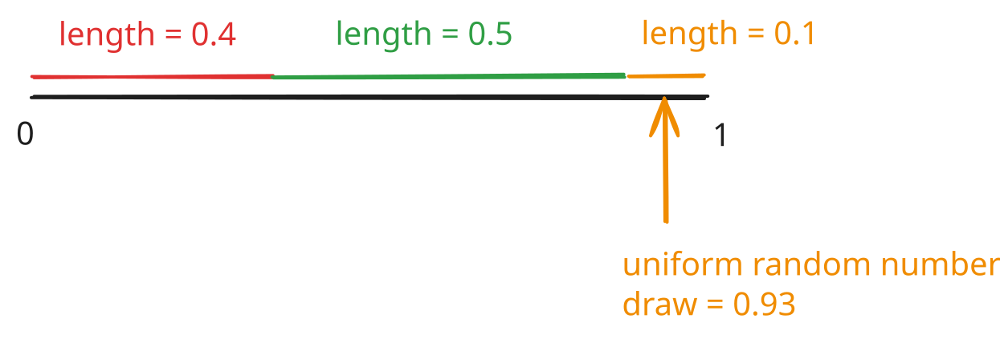

**IN PROGRESS**

In the [last entry](https://treeinrandomforest.github.io/ml/posts/rl1-intro/), we covered the basic formalism of a Markov Decision Process (MDP). We looked at state and action spaces, rewards, trajectories and policies.

In this write-up, we'll look at two crucial quantities. Suppose, we are given the following:

* An environment i.e. a state space $\mathcal{S}$, an action space $\mathcal{A}$ and a simulator (or real-life setup) that can execute the unknown (to us) transition function $p(s' | s, a)$.

* A reward function $r(s,a)$ which can be used to compute trajectory level rewards $R(\tau) = r(s_0, a_0) + \gamma r(s_1, a_1) + \gamma^2 r(s_2, a_2) + \ldots$ where $\gamma$ is the discount factor (in $(0,1)$).

* A policy $\pi(a | s)$ that takes a state as an input and maps to an action. The policy can be determinstic (map state to one action) or stochastic (for a given state, produce a probability for picking each action).

The central task in RL is to pick a good policy. Recall that a policy is a rule that maps states to actions i.e. $s \mapsto a$ (determinstic policy) or states to probabilities over actions $s \mapsto (p(a_1), p(a_2), \ldots, p(a_N))$ if there are N distinct actions. In short, policies tell an actor (also known as the **agent**) how to act or what decisions to make. Intuitively, a "good" policy will lead to trajectories $\tau = s_0 \rightarrow a_0 \rightarrow s_1 \rightarrow a_1 \rightarrow \ldots$ that have "high" rewards, $R(\tau) = \Sigma_{i=0}^{T} \gamma^i r(s_i, a_i)$.

To identify high-reward actions, it's useful to compute two quantities:

* The "quality" score of a state $s_t$. This quantity assesses if it's desirable to land up in this state. Formally, this is called the **state value function** $v(s)$. For convenience, $v(s)$ is also referred to as the value function.

* The "quality" score of an action in a given state. This quantity assesses how desirable it is to take an action in the given state. Formally, this is called the **state-action value function** $Q(s, a)$. For convenience, $Q(s,a)$ is also called the Q-function or Q-value.

Let's define the two quantities.

#### State-action value function $Q(s,a)$

Assume we're given a policy $\pi$, which lets us generate trajectories.

Suppose, at time t in a trajectory, we land in state $s_t$ and are forced to take an action $a_t$. The transition function will take into a state $s_{t+1}$ according to the probability $p(s_{t+1}|s_t, a_t)$. We can now use the policy $\pi$ to generate the next action, land in a new state $s_{t+2}$ according to the transition function and so on till some stopping criterion is satisfied. At each step, we'll get a reward and we can define a partial-trajectory reward known as **reward to-go**:

$$G_t = r(s_t, a_t) + \gamma r(s_{t+1}, a_{t+1}) + \gamma^2 r(s_{t+2}, a_{t+2}) + \ldots = \Sigma_{t'=t}^{T} \gamma^{t'-t} r(s_{t'}, a_{t'})$$

It might be helpful to set $\gamma=1$ to see that $G_t$ is simply the some of future rewards ("to-go") starting from time $t$. The notation $G_t$ is used to be consistent with Sutton and Barto's book in case you use it although they start the sum at $t+1$ (different definition).

To summarize, given a state $s_t$ at time $t$ and a forced action $a_t$ at time t, we can rollout the trajectory with policy $\pi$ and compute a number $G_t$ that's the reward to-go.

If we were to repeat this experiment, we would get a different trajectory after time $t$. This is because:

* The policy might be stochastic and not determinstic i.e. $\pi(s)$ gives a distribution over actions ($a_1$ with probability 40\%, $a_2$ with probability 60\%) and repeated runs will choose different actions (see aside on sampling below).

* The transition function might be stochastic and not determinstic i.e. even if one takes the same action in the same state, $p(s' | s, a)$ defines a probability distribution over $s'$ and we'll end up in different states in repeated runs.

**Aside on sampling**:

Suppose, we have three possible actions:

$a_1$ with probability 0.4

$a_2$ with probability 0.5

$a_3$ with probability 0.1

We could just choose $a_2$ since it has the highest probability. Another option is to **sample** i.e. pick different actions according to their probabilities, as shown i figure 1 below.

Since all the probabilities have to add up to 1, put them consecutively on the $[0,1]$ interval. Sample a uniform random number and place it on the interval. In the figure, $0.93$ is drawn and placed. It lands in the interval "owned" by $a_3$ and so we would pick $a_3$. In general the probability of a random number landing in one of the intervals is proportional to the length of the interval.

**End of Aside**

For each sub-trajectory starting at $s_t$ with action $a_t$, we have one reward to-go value, $G_t$. We can now define the "quality" of ($s_t$, $a_t$) as the average (over all trajectories generated beyond time $t$) $G_t$.

$$Q(s_t, a_t) = \frac{1}{\text{number of trajectories}} \Sigma_{i=1}^{\text{num traj}} G_t^{(i)}$$

This is written more formally as:

$$Q(s_t, a_t) = \mathbb{E}_{s\sim p(.|s,a),a\sim \pi(s)}[G_t | s_t, a_t]$$

We'll unpack this shortly. Intuitively, you should think of $Q(s_t,a_t)$ as the "average discounted cumulative reward (reward to-go) if one is forced to take action $a_t$ in state $s_t$ and then take future actions according to the policy $\pi$". The part of using the policy $\pi$ to take future actions is crucial and is made explicit by writing $Q^{\pi}(s_t,a_t)$.

Let's now unpack:

$$Q^{\pi}(s_t, a_t) = \mathbb{E}_{s\sim p(.|s,a),a\sim \pi(s)}[G_t | s_t, a_t]$$

The first important piece is $\mathbb{E}$. This is called the **expected value**. More precisely, in probability theory, one works with objects called **random variables**. You can think of a random variable as a quantity take can take multiple values, each with a specific probability. The simplest example or a random variable is a coin toss i.e.

$$X = 
\begin{cases}
  0 & \text{if heads with probability $p$}\\
  1 & \text{if tails with probability $1-p$}
\end{cases}
$$

The expected value of X i.e. $\mathbb{E}X$ is the average outcome i.e.

$$\mathbb{E} = 0.p + 1.(1-p) = 1-p$$

This might look mysterious so let's look at an illustrative example. Suppose you are given the following data for test scores for 10 students:

$$3,3,3,3,5,5,7,9,9,9$$

The average score would be:

$$\frac{3+3+3+3+5+5+7+9+9+9}{10} = \frac{3*4 + 5*2 + 7*1 + 9*3}{10} = 3*\frac{4}{10} + 5*\frac{2}{10} + 7*\frac{1}{10} + 9*\frac{3}{10}$$

The ratios are precisely the probabilities of picking students with certain scores i.e. the \% of students with each unique score:

$$3*p(3) + 5*p(5) + 7*p(7) + 9*p(9)$$

In other words, the average is the "sum of each unique value multiplied by the probability of observing the value". Mathematically, we could write:

$$\mathbb{E}X = \Sigma_{x} x * p(x)$$

where the sum $\Sigma_{x}$ is over all unique values $X$ can take. Often the probability distribution is made explicit by writing $\mathbb{E}_{x \sim p(x)}X$.

Going back to $Q^{\pi}$:

$$Q^{\pi}(s_t, a_t) = \mathbb{E}_{s\sim p(.|s,a),a\sim \pi(s)}[G_t | s_t, a_t]$$

We see that the random variable is $G_t = \Sigma_{t'=t}^{T} \gamma^{t'-t} r(s_t,a_t)$. The $| s_t, a_t$ part signifies that we have a known fixed state and known fixed action at time $t$. Lastly, $\mathbb{E}_{s\sim p(.|s,a),a\sim \pi(s)}$ specifies that actions $s$ are sampled from the transition function $p(s'|s,a)$ and actions are sampled from the policy $\pi(s|a)$.

Theoretically, you could think of computing $Q^{\pi}(s_t,a_t)$ as follows:

* Generate every possible trajectory start at time $t=0$ by taking actions from policy $\pi$ and letting states evolve according to the transition function $p(s'|s,a)$.

* Select the subset of trajectories that hit state $s_t$ at time $t$ and where the action taken is $a_t$ at time $t$.

* For the subset of trajectories, compute the discounted reward to-go $G_t$ for every trajectory.

* Average these reward to-go values to get $Q^{\pi}(s_t,a_t)$.

This is computationally intractable. For example, if we have $S$ distinct states and $A$ distinct actions, and each trajectory has $T$ time-steps, we have a total of $(S*A)^T$ trajectories. Even for small values of $S, A, T$ e.g. $S=10, A=10, T=10$, this is $100^{10} = 10^{20}$ i.e. 100 billion billion. If it takes one second to do one rollout, it would take $\sim 10^{12}$ years to generate every trajectory sequentially. This is a trillion years (the universe is about 14 billion years old).

We now understand how to evaluate the quality of a state-action pair using $Q^{\pi}$. Mathematically (and programmatically), $Q^{\pi}$ is a function that maps a state-action pair to a number.

